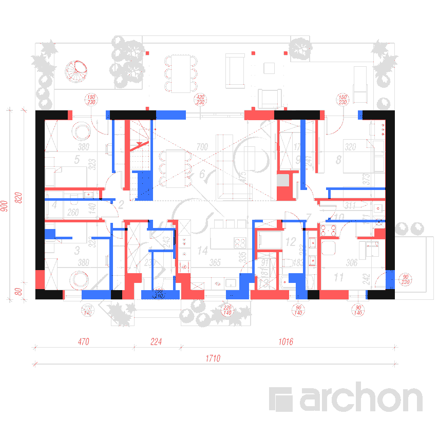
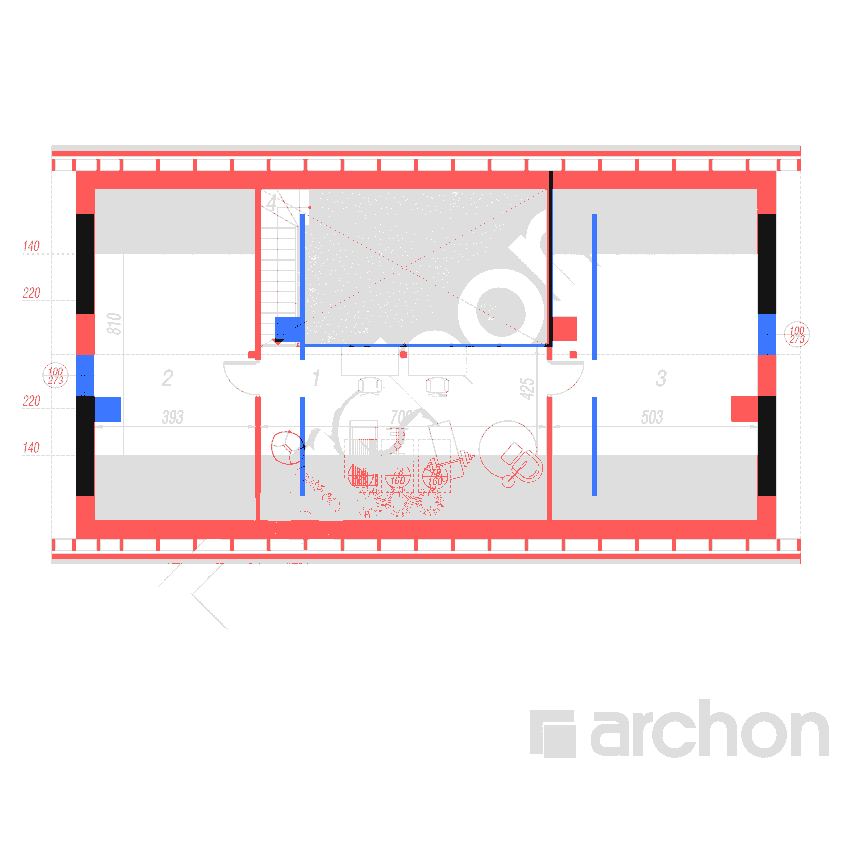

# Validation report -- Dom w Kotewkach 6 (E)

Generated by `just report` (`kotewki.report`). **Do not edit this file**: it lives in `build/`, which is generated and never hand-authored. Fix the spec and rebuild.

- Source project: <https://www.archon.pl/projekty-domow/projekt-dom-w-kotewkach-6-e-m3fd297061d375>, variant `E`, figures retrieved 2026-08-30
- Spec: `spec/*.json`, sha256 `c9f1a3a7a0988793`
- Artifact: `build/model.glb`, 111,860 bytes, sha256 `0b45f5c3b23d1fe2`
- Mesh: 106 nodes, 1,400 vertices, 2,428 faces

There is no timestamp in this report on purpose. It is a deterministic function of the spec, so two runs against an unchanged spec produce byte-identical output and a diff means something really changed.

## Verdict

| Check | Result |
|---|---|
| Global invariants | **5/5** inside tolerance |
| Published area equations | **17/18** inside +-1% |
| of which independent | **16** (18 run, 2 attic checks algebraically dependent) |
| Mean signed area error | -0.06% |
| RMS area error | 0.56% |
| Failure pattern | `single_room` |
| Unanalysed failures | **0** (1 outside +-1%, all 1 of them recorded and diagnosed) |

The model is **well-evidenced**, not proven. Read the limitation at the end of this report before quoting any number here.

## Global invariants -- published vs computed

Values read from `build/quantities.json`; tolerances and pass/fail read from `tests/test_invariants.py`, so nothing here is a number typed into a report.

| Invariant | Computed | Published | Delta | Tolerance |  | Validates |
|---|---|---|---|---|---|---|
| usable area | 163.1006 m2 | 163.57 m2 | -0.287% | +-1% | PASS | interior layout + wall thicknesses |
| footprint | 154.4224 m2 | 154.42 m2 | +0.002% | +-1% | PASS | exterior envelope at ground level |
| cubature | 849.6268 m3 | 849.27 m3 | +0.042% | +-1.5% | PASS | storey heights + roof volume + plinth |
| roof area | 227.6207 m2 | 216.80 m2 | +4.991% | +-6% | PASS | 35 deg pitch + eave overhangs |
| building height | 7.0809 m | 7.09 m | -9.1 mm | +-30 mm | PASS | section geometry, ground -> ridge |

**Two of these are only meaningful because the ridge is an output.** It is computed as `attic_floor 3040 + knee_wall 290 + roof_buildup 280 + 4500 * tan 35deg = 6760.93 mm` and never assigned from the printed 6770. That wire is cut in four places in the suite, including a rebuild with `section_elevations.ridge` set to 99999.

## How strong is the checksum, counted honestly

**18 published-area equations are run, of which 16 are independent.** Not 18, and not the ~19 an earlier draft of this project asserted. Counted by `tests/test_room_areas.py::independent_equation_count`, not by hand, and pinned by a test so it cannot quietly drift back up.

|  | Count |
|---|---|
| Equations run | 18 |
| Ground floor | 11 |
| Attic | 7 |
| Attic checks algebraically dependent | 2 |
| **Independent equations** | **16** |

Two concrete reasons the count is lower than the room table suggests:

- **The ground floor gives 11 equations, not 14.** Hol (2), Salon z jadalnia (6), Hol (7) and Kuchnia (14) are one continuous open-plan space with no masonry between them. Polygonisation correctly returns a single face, so they are checked as one combined area (14 - 4 + 1 = 11). Their published splits are the publisher's virtual measuring lines (x 4500, y 3800, x 11500), not walls; checking them individually would fail no matter how correct the geometry is.
- **Two attic checks are algebraically dependent.** Both `Strych ocieplony` rooms span the full building depth, so both roof slopes band them by the same constant counted depth (3.779 m): their banded figure and their floor figure are two readings of one unknown. Only Antresola stops short of the ridge and so adds genuine information.

Alongside these sit the 5 global invariants and 15 dimension-chain closures, which constrain the model from directions the room areas cannot reach.

## Per-level floor area -- the strongest check in the project

**This is the check that consumes no published input at all.** Every other headline figure has something handed to it: the usable-area invariant is given a 2.63 m2 stair run read off the published table (see "Deliberate decisions" below), and the room areas are compared one at a time. Per-level floor area is pure geometry against a pure published number, with nothing fed in either direction.

| Level | Rooms | Faces | Floor computed | Floor published | Residual | Counted computed | Counted published | Residual |
|---|---|---|---|---|---|---|---|---|
| ground | 14 | 11 | 118.3700 | 118.81 | -0.370% | 115.7399 | 116.18 | -0.379% |
| attic | 4 | 4 | 103.7261 | 103.83 | -0.100% | 51.0181 | 51.03 | -0.023% |

ground -0.37%, attic -0.10%. Both inside +-1% with no deduction, no allowance fitted per level, and no published figure consumed by the computation.

## Every published-area equation

All measured to the **finished** face (PN-ISO 9836, *w swietle scian*), which is the convention Archon publishes; the printed chains dimension raw structure. `usable` is the published room figure -- height-banded on the attic, plain floor area elsewhere. `floor` is the parenthesised floor figure against the unbanded polygon. `group` is the open-plan aggregate that stands in for four rooms at once.

| Check | Room | Level | Kind | Computed m2 | Published m2 | Rel | Status |
|---|---|---|---|---|---|---|---|
| `A_R1:floor` | Antresola | attic | floor | 29.302 | 29.40 | -0.33% | ok |
| `A_R1:usable` | Antresola | attic | usable | 14.432 | 14.51 | -0.54% | ok |
| `A_R2:floor` | Strych ocieplony | attic | floor | 31.353 | 31.31 | +0.14% | ok |
| `A_R2:usable` | Strych ocieplony | attic | usable | 14.731 | 14.67 | +0.42% | ok |
| `A_R3:floor` | Strych ocieplony | attic | floor | 39.414 | 39.48 | -0.17% | ok |
| `A_R3:usable` | Strych ocieplony | attic | usable | 18.198 | 18.21 | -0.07% | ok |
| `A_R4:usable` | Schody | attic | usable | 3.658 | 3.64 | +0.48% | ok |
| `G_R1:usable` | Wiatrołap | ground | usable | 5.401 | 5.35 | +0.96% | ok |
| `G_R10:usable` | Pralnia | ground | usable | 4.956 | 4.94 | +0.32% | ok |
| `G_R11:usable` | Kotłownia | ground | usable | 7.183 | 7.31 | -1.74% | **FAIL (recorded, diagnosed)** |
| `G_R12:usable` | Łazienka | ground | usable | 5.861 | 5.85 | +0.18% | ok |
| `G_R13:usable` | Spiżarnia | ground | usable | 1.540 | 1.54 | -0.01% | ok |
| `G_R3:usable` | Pokój | ground | usable | 11.994 | 11.99 | +0.04% | ok |
| `G_R4:usable` | Łazienka | ground | usable | 3.482 | 3.48 | +0.05% | ok |
| `G_R5:usable` | Pokój | ground | usable | 11.994 | 11.99 | +0.04% | ok |
| `G_R8:usable` | Pokój | ground | usable | 13.064 | 13.05 | +0.11% | ok |
| `G_R9:usable` | Garderoba | ground | usable | 3.958 | 3.96 | -0.05% | ok |
| `OPEN_PLAN:group` | Hol + Salon + Hol + Kuchnia (one face) | ground | group | 48.937 | 49.35 | -0.84% | ok |

**17 of 18 inside +-1%.** The tolerance is not widened anywhere. The three outliers are recorded as findings with their measured values, and the suite asserts the outlier set is *exactly* that set -- a new room drifting out fails, and a recorded one coming back inside also fails.

### The residuals, in full

- **`G_R11:usable`** -- Kotlownia -1.7% (7.183 vs 7.31). Printed 306 x 242 raw. Reproducing 7.31 needs ~9 mm per face, or a width of 311 -- but 311 is the Pralnia's bay one storey north and adopting it here breaks the lower x chain G_C3. Known before T08 ran; see README 'Known area-check limitations'.

## Other published figures

Computed and published side by side. **Status says whether the suite actually asserts the figure** -- most of these are cross-checks that would be dishonest to present as passing tests.

| Figure | Computed | Published | Residual | Status |
|---|---|---|---|---|
| Net area | 126.6461 m2 | 127.02 m2 | -0.294% | reported |
| Floor area | 222.0960 m2 | 222.64 m2 | -0.244% | reported |
| Attic area (pow. strychu) | 32.9291 m2 | 32.88 m2 | +0.149% | reported |
| Boiler room (Kotlownia) | 7.1829 m2 | 7.31 m2 | -1.739% | asserted, +-1%, recorded FAIL |
| Ridge above ground | 6.7609 m | 6.77 m | -0.134% | reported |
| Eave above ground | 2.8799 m | 2.88 m | -0.004% | asserted |

Not computed at all: **total area 307.07 m2**. Archon's *powierzchnia calkowita* convention (which external and structural areas it sweeps in) is not stated on the project card, and this project does not compute figures whose definition it cannot pin down. Roof pitch 35.0deg is a spec *input*, asserted exactly, not a computed result.

## Vertical geometry

| Plane | Elevation m | Basis |
|---|---|---|
| Terrain | -0.3200 | printed on `section.png` |
| Ground floor | +0.0000 | datum |
| Attic floor (slab top) | +3.0400 | printed |
| Knee wall top / ceiling plane | +3.3300 | attic floor + 290 published knee wall; **band the attic from here** |
| Roof outer plane at wall face (springing) | +3.6100 | + 280 `roof_buildup_vertical`, `derived: true`, the only derived input in the ridge chain |
| Eave (fascia underside at the overhang edge) | +2.8799 | output: springing - 600*tan35 - 310 fascia; printed 2.880, 0 mm out |
| Ridge | +6.7609 | **output**, never assigned: springing + 4500*tan35; printed 6.770, -9 mm |

Pitch **35.0deg** (spec input, asserted exactly), span 9.0 m, eaves overhang 0.6 m, verge overhang 0.59 m.

**Three parallel planes, and using the wrong one silently corrupts a different check each time.** The 1.4/2.2 banding contours are measured to the *ceiling* (3.330), which is `roof_buildup_vertical` lower than the roof's *outer plane* (3.610); banding from 3.610 puts the contours ~0.4 m out and over-reads the attic by ~20%. The 2.880 mark is the *eave fascia underside*, 0.60 m outboard of the wall, and is not in the wall chain at all -- mislabelling it "wall plate top" is what produced this project's original phantom roof discrepancy.

## Measurement norm and finish allowance

**Resolved: PN-ISO 9836, measured *w swietle scian* (to finished faces, plaster included), with sloped-ceiling bands at 1.4 m and 2.2 m.** Archon states the norm explicitly on the project card (powierzchnia użytkowa (bez schodów), powierzchnia zabudowy, powierzchnia całkowita, kubatura), and `plan_attic.png` independently prints its ceiling-height contour lines labelled `140` and `220`. T15 asked this question and is superseded rather than skipped; the evidence is recorded rather than re-derived.

**Finish allowance: 20 mm per face, and it stays `derived: true`.** It is solved-for, not published. T08 swept 0-30 mm across all 18 equations, none excluded: the curve is convex with a single minimum at 19 mm (RMS 0.62%), and 20 mm is statistically indistinguishable (0.63%). `finish` beats `structure` on every metric -- RMS 0.63% vs 2.99%, mean -0.14% vs +2.46%, 2 failures vs 14 -- and at `structure` the failure classifier returns `uniform_offset`, which is exactly the predicted pre-allowance signature. Runnable: `uv run python tests/test_room_areas.py --sweep`.

**Residual ambiguity, stated rather than buried:**

- Schody takes no allowance at all, and that is now data in the spec: `rooms[].measure_to = {face: structure}` on `A_R4` and on no other room. Under PN-ISO 9836 a stair is the plan projection of its flight and landings -- the slab opening -- and two of its four edges are a void edge and a guard, with no plaster to deduct. This is not a point dropped from the fit to make the fit look better: T18 showed no allowance in 0-30 mm brings the room inside +-1% (it needs <= 4.1 mm/face) and that at structure it lands at +0.5%. It is left in the sweep, where it now contributes the same constant at every allowance.
- Kotlownia and Lazienka (12) are not explained by any allowance in 0-30 mm. They look like genuine publisher-vs-plan disagreements of ~0.07-0.13 m2.
- The 19 mm optimum was rounded to 20 mm because 20 mm is the round number an architect would specify. That is a judgement, not a measurement.

## Deliberate decisions and where this report is weaker than it looks

These are choices, not results. Listed here rather than left implicit in a passing test.

### Two tolerances were widened, and why

- **Roof area, +-1% -> +-6%.** Measured overhangs (600 mm eaves, 590 mm verge, traced on two independent images) give 227.62 m2 against a published 216.8 m2, +4.991%. Reproducing 216.8 needs a 0.44 m uniform overhang. **T17 declined to shrink the overhang to fit**, because the overhang is measured and the publisher's *powierzchnia dachu* convention is not known -- it may or may not include overhangs, gable rakes or covering laps. This is a band on one invariant whose *definition* is unknown, not a tolerance widened to make a failure go away, and it keeps its teeth: the refuted 40.7deg pitch reads +13.4% and fails it.
- **Building height, +-10 mm -> +-30 mm.** `roof_buildup_vertical` (280 mm) carries a measured +-30 mm uncertainty and is the only derived input in the ridge chain, so +-10 mm claimed a precision the inputs do not support. It would have passed with 0.93 mm to spare, which is luck rather than evidence. The computed value (7.080934 m, -9.07 mm) is separately pinned at 1e-5, so nothing is lost by the wider band.

### The usable-area invariant is weaker than it looks, and says so

It deducts a **2.63 m2 ground-floor stair run** that nothing in `spec/ground.json` models. The figure is read two independent ways off the published table -- `Salon 33.20 - 30.57` and `ground 118.81 - 116.18` -- and the export fails if the two readings disagree. But it is still **published information handed to the check**, so the invariant independently constrains 160.94 m2 of the 163.57 m2, not all of it. Undeducted, usable reads 165.7306 m2 (+1.27%) and would fail its own +-1% band. Per-level floor area, above, consumes nothing and is the honest check.

### The mesh is not a solid

The exported solids interpenetrate by a measured **21.0028 m3** across 149 pairs against 267.108 m3 of member volume -- **7.9% double-counted**. Two classes: chimney stacks traced once per storey pass through the walls they abut, and ground exterior walls run up into the attic slab band. All 106 components are individually watertight, winding-consistent and positive-volume; the *scene* is not. This is invisible in glTF and nothing is wrong today, because cubature is a closed-form integral over the 2D footprint and touches no mesh volume -- but `sum(mesh.volume)` would over-read cubature by ~8% and is material volume anyway, not the gross enclosed volume cubature asks for. The totals are pinned in `tests/test_export.py` so the trap cannot be walked into silently.

### Golden overlay images are not signed off yet

`tests/golden/` is deliberately empty and the golden-diff tests **skip** with a message saying so. Human sign-off on the first goldens is deferred to the end of the project by user decision: an auto-accepted golden locks in whatever was wrong at the time, which is worse than no golden. Two skips in the suite are these, and they are a normal state, not an error. The overlays themselves are generated on every build and are shown below.

## Open items

Tracked work and unresolved questions, in priority order. Nothing here is hidden behind a passing test.

1. **CLOSED (T18/T19): the Schody residual was a measurement convention.** The old diagnosis -- a ~0.25 m2 unmodelled stairwell landing nub, to be added to the polygon -- was wrong, and so was the counter-reading that the box east of the flight is a balustrade post or furniture. T18 re-measured both bitmaps: the box is **floor** (floor tone 236 against the void tone 197, and the stair's walking line originates inside it), but adding it to the current polygon overshoots to +6.8%, because it is only admissible together with narrowing the flight from 950 to 872 mm and the two corrections cancel. The real fault was the finish convention: the published 3.64 m2 is the drawn slab opening at raw structure, and the L as drawn has a 10.084 m perimeter, so *any* allowance above 4.1 mm/face fails +-1%. `A_R4` now carries `measure_to` in `spec/attic.json` and its south edge sits on the printed 4700: 3.6575 m2, +0.5%. See `docs/T18-findings.md` item 1.
2. **CLOSED (T18/T19): the roof-window depth never disagreed with its callout.** The recorded 3.1% was a one-pixel tracing error, not a fact about the drawing: 1271 mm was measured to the *inner* faces of the two dashed lines instead of their centres. Line centre to line centre the depth is 1296 +- 12 mm against `1600 * cos 35deg = 1310.6 mm`, a residual of 14.6 mm / 1.1% / 0.6 px on a raster whose pixel is 24.46 mm -- the two agree, and T18 does not claim to have distinguished them. The convention is calibrated in place: the same box measured the same way in x reproduces its PRINTED 780 mm width to 0.07 px. The bounds in `spec/meta.json` are now y 1149..2446 and the generator models that. See `docs/T18-findings.md` item 2.
3. **Published roof area 216.8 m2 vs 227.6 m2 measured (+5.0%).** Asserted as a +-6% band with the reasoning documented, not silently widened. See above.
4. **Kotlownia (-1.74%) and Lazienka 12 (-1.27%)** are not explained by any finish allowance in 0-30 mm. Likely irreducible publisher-vs-plan disagreements of ~0.07-0.13 m2, but that is a conclusion by elimination, not a finding.
5. **Mesh solids overlap** -- measured exhaustively, invisible in glTF, and a trap for anyone who later computes cubature by summing mesh volumes. See above.
6. **CLOSED (T18/T19): the gable windows really are not centred, and the spec is right.** A_O1/A_O2 sit at `offset` 4275 on 8550-long walls; centred would be 3775. Confirmed on `elevation_side_1.png` and `elevation_side_2.png`: on both gables the window's near jamb sits on the ridge line to under 1 px, and a centred window is excluded by 29 px against 2 px of noise. Which window is north and which is south is independently confirmed by the chimney positions. Recorded separately and NOT acted on: the renders put the glazing at `z ~ 3584..5913` where the spec has 3040..5770, a ~0.5 m vertical difference, with the bay below the eaves reading as a concrete spandrel -- the `100/273` callout is the authority and a marketing render is not. See `docs/T18-findings.md` item 3.
7. **Roof build-up split undetermined.** `roof_buildup_vertical` 280 mm and `fascia_depth` 310 mm are measured lumped values; the rafter/insulation/covering split is unknown. Affects visual detail only -- but the 280 mm is what carries the +-30 mm that sets the building-height band.
8. **Golden overlay images await human sign-off.** The last gate before the project is done.

## Transcribed vs derived

**A derived value is one that was inferred, computed or assumed rather than read off a number printed on a source document.** The schema forces a `note` onto every one of them, because a derived value with no stated basis is indistinguishable from a guess. Every single one is listed below with that justification -- the difference between a report and a marketing page.

| Spec section | Objects | Carrying derived values | Fully transcribed |
|---|---|---|---|
| levels | 2 | 0 | 2 |
| walls | 38 | 28 | 10 |
| openings | 24 | 24 | 0 |
| rooms | 18 | 0 | 18 |
| dimension_chains | 15 | 11 | 4 |
| slab_openings | 2 | 2 | 0 |
| roof_openings | 3 | 3 | 0 |
| **entities total** | **102** | **68** | **34** |

Counting every annotatable object in the merged spec, including the `construction` and `roof` blocks that are not entity arrays: **73 objects carry a derived annotation** -- 13 are entirely derived (`derived: true`) and 60 are partly derived, naming 101 specific fields between them.

No spec object is currently marked `disputed`. The roof block carried `disputed: true` until T17 resolved the pitch at 35.0deg.

### Every derived value, with its justification

Expand -- 73 entries

- **`G_W9`** (walls[8]) -- `thickness` Wall between Pokoj (5) and the stair / Salon bay, masonry x 4250..4500. Position is PRINTED on both sides: the 380 room width puts its west face at 450 + 3800 = 4250, and the 700 Salon width puts its east face at 11500 - 7000 = 4500. Thickness 250 is therefore not free - it is the residual that makes the upper x chain close (chain G_C2, 45+380+25+700+12+171+12+320+45 = 1710) - and it is confirmed by the drawing, which renders this wall 10 px = 244 mm where every other partition renders 5 px = 122 mm. Marked derived because 25 is not printed as a number. It is the only 250 mm internal wall on the level and it is the one carrying the staircase.
- **`G_W10`** (walls[9]) -- `thickness` Partition between Pokoj (3) and Wiatrolap (1), masonry x 4250..4370. West face at 4250 from the printed 380; east face at 4370 from the printed 230 Wiatrolap width measured back from 6670. Thickness 120 is DERIVED as the residual of the lower x chain G_C3 and is drawn 5 px = 122 mm. Consistent with a Porotherm 11.5 partition plus plaster. No opening: plan cols 243..247 are unbroken from row 428 to row 551.
- **`G_W11`** (walls[10]) -- `thickness` Partition between Wiatrolap (1) and Kuchnia (14), masonry x 6670..6790. Fixes both printed room widths at once: 4370 + 2300 = 6670 (the printed 230) and 6790 + 3650 = 10440 (the printed 365). Drawn 5 px, unbroken rows 428..550, so there is no direct door from the vestibule to the kitchen - the Wiatrolap opens only northwards into the Salon.
- **`G_W12`** (walls[11]) -- `thickness` Partition between Lazienka (4) and Hol (2), masonry x 3050..3170. West face at 450 + 2600 = 3050 from the printed 260 Lazienka width. Drawn at plan cols 193..197, present rows 365..388 and 425..432 - the 36-row break between them is the door G_O13.
- **`G_W13`** (walls[12]) -- `thickness` The long east-west partition at y 3680..3800 that forms the north wall of Pokoj (3), Hol (2) and Wiatrolap (1) and the south wall of Lazienka (4) / Salon (6). Its line is fixed three independent printed ways: 450 + 3230 = 3680 (Pokoj 3's printed 323), 1250 + 2430 = 3680 (Wiatrolap's printed 243) and 8550 - 4750 = 3800 (the Salon's printed 475). Drawn at plan rows 428..432, in three runs - cols 69..203, 241..289 and 327..346 - so the two breaks are real openings, not a broken transcription: G_O14 (into Pokoj 3) and G_O15 (Wiatrolap into the Salon).
- **`G_W14`** (walls[13]) -- `thickness` Partition at y 5200..5320, north wall of Lazienka (4) and Hol (2), south wall of Pokoj (5). Fixed by two printed numbers meeting on it: 3800 + 1400 = 5200 (Lazienka's printed 140) and 8550 - 3230 = 5320 (Pokoj 5's printed 323). Drawn at plan rows 365..370 in two runs, cols 88..202 and 241..252; the break is the door G_O16.
- **`G_W15`** (walls[14]) -- `thickness` Partition between Kuchnia (14) and Spizarnia (13) / Lazienka (12), masonry x 10440..10560. West face at 6790 + 3650 = 10440 from the printed 365; east face at 11470 - 910 = 10560 from the printed 91. Drawn at plan cols 496..500, present rows 444..504 and 538..549 - the break rows 505..537 is the pantry door G_O17.
- **`G_W16`** (walls[15]) -- `thickness` Partition between Spizarnia (13) and Lazienka (12), masonry x 11470..11590. Fixed by 10560 + 910 = 11470 (printed 91) and 11590 + 1830 = 13420 (printed 183). Terminates on G_W17's centreline y = 2320; its masonry therefore stops at G_W17's north face 2380. CORRECTED: this wall previously ran to y = 2930 and its note claimed the ink was 'unbroken rows 462..564'. It is not. A column scan at cols 538..542 on plan_ground.png reads flat white 254 for every row from 455 to 482, a 128-grey thin line at 483 (the shower enclosure, not masonry), antialiasing at 485, and solid 0 only from row 486 down. Drawn top edge is row 485.5 -> y = 2384 +-12, i.e. G_W17's north face. The old endpoint pushed a 120 x 550 mm stub of wall north into the Lazienka's shower, which is what T13's overlay showed as a model-only (blue) rectangle at x 11481..11555, y 2397..2935. Found by human inspection of build/overlay_ground.png, not by any numeric check -- the stub is 0.066 m2 and was being absorbed as the Lazienka's -1.27% residual, which this project had wrongly written off as an irreducible publisher-vs-plan disagreement. NOTE the 30 mm jog against G_W23 above it: the upper x chain puts the corresponding wall at 11500..11620 and the lower at 11470..11590. Both are printed-number-driven and both chains close exactly at 1710, so the jog is transcribed rather than smoothed away.
- **`G_W17`** (walls[16]) -- `thickness` North wall of the Spizarnia (13), masonry y 2260..2380. South face at 450 + 1810 = 2260 from the printed 181. Drawn at plan rows 486..490, cols 496..549, unbroken - the pantry is entered only from the kitchen. This wall is what makes Lazienka (12) L-shaped: above it the bathroom wraps west over the pantry.
- **`G_W18`** (walls[17]) -- `thickness` North wall of Lazienka (12), masonry y 3280..3400. South face at 450 + 2830 = 3280 from the printed 283. Drawn at plan rows 444..448 in two runs, cols 496..552 and 589..622; the break is the door G_O18 from Hol (7).
- **`G_W19`** (walls[18]) -- `thickness` Wall between Lazienka (12) and Kotlownia (11), masonry x 13420..13590. THIS IS THE ONE 170 mm WALL ON THE LEVEL and it is not an arbitrary choice: the printed 183 puts its west face at 13420 and the printed 306 puts its east face at 16650 - 3060 = 13590, and 17 cm is exactly the residual that closes the lower x chain G_C3 at 1710. The drawing corroborates it - plan cols 618..624 render 7 px here against 5 px for every 120 mm partition and against the 5 px that the SAME column band renders further north (G_W21, rows 386..460), which is why the Pralnia reads 311 and the Kotlownia 306 across the same bay. Marked derived because 17 is not printed; a plausible physical reading is a 115 partition plus a boiler-room flue, but nothing on the plan states that.
- **`G_W20`** (walls[19]) -- `thickness` North wall of the Kotlownia (11), masonry y 2870..2990. South face at 450 + 2420 = 2870 from the printed 242, north face at 4700 - 1710 = 2990 from the printed 171. Drawn at plan rows 460..465, cols 625..657 and 697..748; the break is the door G_O19.
- **`G_W21`** (walls[20]) -- `thickness` Partition between Hol (7) and Pralnia (10), masonry x 13420..13540. East face at 16650 - 3110 = 13540 from the printed 311. Drawn 5 px at plan cols 618..622, present rows 386..397 and 435..460 - the break rows 398..434 is the door G_O20. Note this wall is 120 while G_W19 directly below it in the same column band is 170; that 50 mm step is exactly the printed difference between the Pralnia's 311 and the Kotlownia's 306.
- **`G_W22`** (walls[21]) -- `thickness` Wall at y 4700..4820: north wall of Hol (7) and Pralnia (10), south wall of Pokoj (8). Fixed by 2990 + 1710 = 4700 (the printed 171 Pralnia depth) and 8550 - 3730 = 4820 (the printed 373 Pokoj 8 depth). Drawn at plan rows 386..390, cols 613..768. Its west 930 mm - between the chimney stack G_W27 and col 613 - is unbuilt and is the door G_O21 from the Hol into Pokoj 8. The centreline is run west to the stack's centreline x 11870 rather than stopping at the drawn masonry x 13290, so the wall graph is closed for polygonisation.
- **`G_W23`** (walls[22]) -- `thickness` Partition between Salon (6) and Garderoba (9), masonry x 11500..11620. West face at 4500 + 7000 = 11500 from the printed 700; east face at 13330 - 1710 = 11620 from the printed 171. Drawn at plan cols 540..543, unbroken rows 215..339: the Garderoba is NOT entered from the Salon, only from Pokoj (8) through G_O22.
- **`G_W24`** (walls[23]) -- `thickness` Partition between Garderoba (9) and Pokoj (8), masonry x 13330..13450. Fixed by 11620 + 1710 = 13330 (printed 171) and 16650 - 3200 = 13450 (printed 320). Drawn at plan cols 614..618, unbroken rows 234..338.
- **`G_W25`** (walls[24]) -- `thickness` South wall of the Garderoba (9), masonry y 6020..6140. North face at 8550 - 2410 = 6140 from the printed 241. Drawn at plan rows 332..336, cols 570..581; west of col 570 the same line is absorbed into the chimney stack G_W27 (drawn masonry therefore starts at x 12240) and east of col 581 it is the door G_O22. The centreline is run out to G_W23's centreline at x 11560 rather than stopping at the drawn masonry, so the wall graph is closed for polygonisation - the same convention T05 used on the attic partitions.
- **`G_W26`** (walls[25]) -- `<entire object>` Short pier closing the south-east corner of the Salon against the Hol (7). Drawn solid at plan cols 539..551, rows 428..448, i.e. x 11480..11800 by y 3400..3790 (13 px x 21 px, +/-25 mm). Nothing dimensions it, hence fully derived; it is modelled 250 mm thick on the Salon's printed east line x = 11500. Above it - y 3800..4700 - the drawing shows no masonry at all, so the Salon and the Hol are open to each other there; that is why Hol (7) at 2.30 m2 reads larger than the walled rectangle alone.
- **`G_W27`** (walls[26]) -- `<entire object>` Fireplace and chimney stack against the Salon's east wall. Drawn solid black at plan cols 539..569, rows 332..390 = x 11500..12240 by y 4700..6140 (+/-25 mm); the yellow kominek badge is printed ON TOP of the black fill (sampled RGB 251,226,0 over rows 342..358), so the block is continuous masonry, not an outlined recess. Not dimensioned anywhere, hence fully derived. Modelled with its centreline on the LONG (north-south) axis so the block is 1440 mm long by 740 mm thick rather than the other way round - T06's pier/stack sanity band caps thickness at 1200 mm and the transposed form trips it, which is a modelling convention, not a dimensional disagreement. This is the same stack T05 recorded one storey up as A_W9 at x 11560..12240, y 4825..5435 - an independent cross-level confirmation of both transcriptions. `height` omitted: the stack passes through the ceiling and is T11's to terminate.
- **`G_W28`** (walls[27]) -- `<entire object>` Second chimney stack, standing in the north-east corner of the Pralnia (10) against the east wall. Drawn solid at plan cols 730..748, rows 445..465 = x 16155..16650 by y 2860..3350 (+/-25 mm). Fully derived. Corresponds to T05's attic stack A_W10 (x 16000..16875, y 2860..3480), which agrees on the y position to 0 mm; the ground-floor block is the smaller of the two readings and is the one measured here. Netting it off is what brings the Pralnia's polygon down towards its published 4.94 m2.
- **`A_W1`** (walls[28]) -- `height` South eaves wall (scianka kolankowa). Thickness 450 is NOT derived: it is forced by two printed numbers, the 810 cm interior clear depth printed on plan_attic.png and the 900 cm overall depth printed on plan_ground.png/site.png -> (900-810)/2 = 45 cm, and the plan draws 18.5 px = 0.452 m at 40.89 px/m. This does NOT contradict construction.exterior_wall.thickness in spec/meta.json, which is 460 mm FINISHED: the render sits OUTBOARD of the 17100 x 9000 structural outline the chains dimension, so 450 is the structural centreline thickness and 460 the finished one. Resolved; an earlier version of this note said 465, which was the 15 mm-render guess T04 later solved at 10 mm against the published 154.42 m2. height 290 is the published 29 cm knee wall (construction.knee_wall_height) applied as a per-wall override because the attic level's 2730 clear height only occurs at the ridge; above 290 mm this elevation is roof, not wall.
- **`A_W3`** (walls[30]) -- `height` North eaves wall (scianka kolankowa). See A_W1 for the thickness and knee-wall reasoning. Column scans at x = 150/220/300/500/650/700 show unbroken masonry from row 171 to row 188 - there is no opening anywhere in the north eaves wall.
- **`A_W5`** (walls[32]) -- `thickness` Partition between Strych ocieplony (2) and Antresola. Position is fixed by the printed 393 cm room width: interior face at x = 450 + 3930 = 4380, centreline 4380 + 60. Thickness 120 mm is DERIVED and is the only free length on the x axis: the printed room widths 393 + 700 + 503 = 1596 must fit the interior clear 1620 (= printed 1710 minus 2 x 45), leaving 24 cm for two partitions, split evenly. Consistent with the drawn 5-6 px (0.12-0.15 m) and with a Porotherm 11.5 partition plus plaster. Centreline is run out to the exterior wall centrelines rather than stopping at their inner faces, so the wall graph is closed for polygonisation.
- **`A_W6`** (walls[33]) -- `thickness` Partition between Antresola and Strych ocieplony (3). Interior face at x = 4500 + 7000 = 11500 from the printed 700 cm Antresola width; the remaining bay is then 16650 - 11620 = 5030 = the printed 503 cm, so the x chain closes exactly. Thickness derived as for A_W5.
- **`A_W7`** (walls[34]) -- `thickness`, `height` Guard along the north edge of the Antresola, where the floor stops and the 'Pustka nad salonem' (void over the living room) begins. The edge itself is PRINTED: 425 cm from the south interior wall face, i.e. 450 + 4250 = 4700 mm. The drawn line sits at plan row 346.0, which in the T13 frame converts to 4720 +- 12 mm, 0.8 px from the printed 4700 (T18 item 1.1 and correction 10; the older reading of 4708 used 8555 rather than 8550 for the north wall face). Thickness 60 mm and height 1100 mm are derived (a balustrade, not masonry - the plan draws a single thin line, not hatched wall), and the guard's THICKNESS AND SIDE are undetermined from the ink: 4700 / 4730 / 4760 span 60 mm = 2.4 px and a 1-px line cannot separate them. The printed 4700 therefore fixes the floor edge, not the guard: the centreline is placed at 4730 so the guard occupies y 4700..4760 and the Antresola floor keeps the full printed 4250 mm depth. That 60 mm band is counted in Schody, not in Antresola - see A_R4's measure_to.extends_under, which is what stops the band belonging to neither room.
- **`A_W8`** (walls[35]) -- `thickness`, `height` Guard along the east edge of the stair opening (Schody); west face at x = 5450, which is the modelled east edge of the stairwell and gives a 950 mm clear width against the partition A_W5. Thickness 100 mm and height 1100 mm derived (balustrade). PROVENANCE CORRECTED (T18 item 1.1): this was previously traced to 'the continuous vertical line at plan column 298.9, present on rows 188-342'. No line exists at col 298.9 over rows 226-346. Over the flight the east boundary is a white-cored double line at cols 294.6..297.5 = x 5338..5409, centre 5374 +- 15, so the DRAWN clear width over the flight is 872 +- 20 mm, not 950. The col-299 line is real but runs on rows 190-225 only and is the WEST edge of the bottom landing box, x 5435 +- 15 (east edge x 5698 +- 15). So the landing box is x 5435..5698, y 7660..8550, about 0.23 m2, and it IS floor - drawn in the floor tone 236 rather than the Pustka's void tone 197, with the stair's walking line originating inside it - not a post and not furniture. It is still NOT modelled: on A_R4's 950 mm rectangle it would over-read to +6.8%, because the omitted landing (+0.23 m2) and the 76 mm-too-wide flight (-0.22 m2) very nearly cancel. See room A_R4's note and docs/T18-findings.md item 1.
- **`A_W9`** (walls[36]) -- `<entire object>` Chimney stack (komin) standing against the east face of partition A_W6, inside Strych ocieplony (3). Drawn solid black at plan x 551.5..577.1, y 316.25..341.25 -> 620 x 610 mm at 40.9 px/m, +/-25 mm. Not dimensioned anywhere, hence fully derived. Modelled as a stub so the room polygon nets it off: together with A_W10 it accounts for 0.78 m2, which is exactly what reconciles Strych ocieplony (3) to its published 39.48 m2 floor area. Two chimneys are visible above the ridge on data/source/elevation_side_1.png and elevation_side_2.png, corroborating that these black blocks are stacks and not piers. `height` omitted: the stack passes through the roof and is T11's to terminate.
- **`A_W10`** (walls[37]) -- `<entire object>` Second chimney stack, against the inner face of the east gable wall inside Strych ocieplony (3). Drawn solid black at plan x 731.25..757.5, y 396..421.5 -> 650 x 620 mm at 40.9 px/m, +/-25 mm. Fully derived; see A_W9.
- **`G_O1`** (openings[0]) -- `offset`, `sill` East 180/230 on the garden facade, serving Pokoj (8). Callout '180/230' is PRINTED; width and height are transcribed from it. Masonry break at plan cols 632..705 = 1784 mm, so the opening is placed x 13750..15550 and, G_W7 running east-to-west from x 16875, offset = 16875 - 15550. sill 0 is DERIVED: 2300 + any normal 850 sill would exceed the printed 2700 clear height, and data/source/elevation_garden.png shows this facade fully glazed down to the terrace paving. It is a portfenetr, not a sill window.
- **`G_O2`** (openings[1]) -- `offset`, `sill` The main terrace door off the Salon (6), callout '420/230' PRINTED. Masonry break at plan cols 304..475 = 4202 mm; placed x 5740..9940, offset measured from x 16875 westwards. Drawn as a multi-panel sliding unit - no swing arc is printed, so swing is 'none' as a transcribed fact rather than an omission. sill 0 derived as for G_O1.
- **`G_O3`** (openings[2]) -- `offset`, `sill` West 180/230 on the garden facade, serving Pokoj (5). Callout PRINTED. Masonry break at plan cols 141..214 = 1783 mm; placed x 1760..3560. See G_O1 for the sill.
- **`G_O4`** (openings[3]) -- `offset`, `sill` 220/140 window to Pokoj (3) in the south facade. Callout PRINTED. Masonry break at plan cols 126..215 = 2174 mm; placed x 1390..3590, offset from G_W1's start node at x 225. sill 900 is DERIVED - no sill is printed - and is the standard Polish window sill; 900 + 1400 = 2300 head, which clears the printed 2700 ceiling.
- **`G_O5`** (openings[4]) -- `offset` Front entrance door in the recessed wall, callout '160/210' PRINTED. Masonry break at plan cols 276..342 = 1612 mm; placed x 5060..6660, offset from G_W3's start node at x 4475. SWING: the leaf and arc are drawn OUTSIDE the wall, in the recess, hinged on the east jamb; G_W3 runs west-to-east so the east jamb is the far one, encoded 'right' under the convention 'looking start->end, left = jamb nearer start'. The physical fact is stated here in words so a different downstream convention is recoverable.
- **`G_O6`** (openings[5]) -- `offset`, `sill` 220/140 window to the Kuchnia (14). Callout PRINTED. Masonry break at plan cols 398..487 = 2174 mm; placed x 8030..10230, offset from G_W5's start node at x 7165. sill derived, see G_O4.
- **`G_O7`** (openings[6]) -- `offset`, `sill` 90/140 window to Lazienka (12). Callout PRINTED. Masonry break at plan cols 563..598 = 855 mm; placed x 12070..12970. sill derived, see G_O4.
- **`G_O8`** (openings[7]) -- `offset`, `sill` 90/140 window to the Kotlownia (11). Callout PRINTED. Masonry break at plan cols 679..715 = 880 mm; placed x 14900..15800. sill derived, see G_O4.
- **`G_O9`** (openings[8]) -- `offset`, `sill` External door from the Kotlownia (11) to the east terrace, callout '90/230' PRINTED. The only break in the east wall: plan rows 526..562 = 905 mm, placed y 490..1390, offset from G_W6's start node at y 225. SWING: leaf and arc drawn inside the boiler room, hinged on the SOUTH jamb (y = 490) and opening westwards; G_W6 runs south-to-north so the south jamb is nearer the start, encoded 'left'. sill 0 derived (it is a door).
- **`G_O13`** (openings[9]) -- `width`, `height`, `swing` Door from Hol (2) into Lazienka (4). No stolarka callout is printed for any internal door on this plan. Position IS traced: G_W12 is broken at plan rows 389..424 = 855 mm, i.e. y 3890..4790, offset 150 from the wall's start node at y 3740. Width recorded as the standard 900 the drawing measures to within one pixel; height 2000 assumed. SWING derived: the arc opens eastwards into the Hol and the leaf parks against the wall's south end, so the hinge is the jamb nearer G_W12's start - encoded 'left'. The arc is legible but small at 853 px, so the hinge side is stated as read, not as certain.
- **`G_O14`** (openings[10]) -- `width`, `height`, `swing` Door from Hol (2) south into Pokoj (3). Traced from the break in G_W13 at plan cols 204..240 = 880 mm, x 3290..4190, offset from the wall's start node at x 225. Width 900 / height 2000 as for G_O13. SWING derived: the arc sweeps south-west into Pokoj 3 from the jamb nearer the wall start; encoded 'left'.
- **`G_O15`** (openings[11]) -- `width`, `height`, `swing` Door from the Wiatrolap (1) north into the Salon (6) - the only connection out of the vestibule, since G_W10 and G_W11 are both unbroken. Traced from the break in G_W13 at plan cols 290..326 = 881 mm, x 5390..6290. Width/height/swing as for G_O13; hinge read on the jamb nearer the wall start.
- **`G_O16`** (openings[12]) -- `width`, `height`, `swing` Door from Hol (2) north into Pokoj (5). Traced from the break in G_W14 at plan cols 203..240, x 3280..4180 (930 mm drawn, recorded as the standard 900). Width/height/swing as for G_O13.
- **`G_O17`** (openings[13]) -- `width`, `height`, `swing` Door from the Kuchnia (14) into the Spizarnia (13) - the pantry's only opening. Traced from the break in G_W15 at plan rows 505..537 = 807 mm, y 1130..1930, offset from the wall's start node at y 225. Recorded as 800 rather than 900 because the drawn 807 is a clean one-pixel match to 80 cm. Height and swing derived as for G_O13.
- **`G_O18`** (openings[14]) -- `height`, `swing` Door from Hol (7) south into Lazienka (12). Traced from the break in G_W18 at plan cols 552..589 = 904 mm, x 11800..12700, offset from the wall's start node at x 10500. SWING read directly: the leaf is drawn as a vertical double line at plan col 555 standing north of the wall, so the hinge is the WEST jamb (x 11800) and the door opens north into the Hol - the west jamb is nearer G_W18's start, hence 'left'.
- **`G_O19`** (openings[15]) -- `height`, `swing` Door between the Kotlownia (11) and the Pralnia (10). Traced from the break in G_W20 at plan cols 658..696 = 880 mm, x 14430..15330, offset from the wall's start node at x 13505. Height and hinge side derived as for G_O13.
- **`G_O20`** (openings[16]) -- `height`, `swing` Door from Hol (7) east into the Pralnia (10). Traced from the break in G_W21 at plan rows 398..434 = 904 mm, y 3650..4550, offset from the wall's start node at y 2930. SWING: the arc opens northwards into the Pralnia from the north jamb, which is the far jamb along G_W21's south-to-north direction, hence 'right'.
- **`G_O21`** (openings[17]) -- `height`, `swing` Door from Hol (7) north into Pokoj (8). The masonry of G_W22 only starts at plan col 613 (x 13290): west of that the wall line is occupied by the chimney stack G_W27, so the 930 mm gap x 12360..13290 IS the doorway and there is no jamb masonry on its west side. G_W22's centreline is run west into the stack's centreline (x 11870) rather than stopped at the drawn masonry, so the wall graph closes for polygonisation - the T05 convention; hence offset 490 = 12360 - 11870. SWING read directly: the open leaf is drawn as a vertical line at plan col 578 (x 12410) running north from the wall line, i.e. hinged on the WEST jamb and swinging into Pokoj 8; the west jamb is G_W22's start end, hence 'left'.
- **`G_O22`** (openings[18]) -- `width`, `height`, `swing` Door from Pokoj (8) north into the Garderoba (9) - the dressing room's only opening, since G_W23 and G_W24 are both unbroken. Traced from the break in G_W25 at plan cols 582..613 = 758 mm, x 12510..13290, offset from the wall's start node. G_W25's centreline is run west to G_W23's centreline (x 11560) rather than stopped at the chimney stack's face x 12240, so the wall graph closes for polygonisation; hence offset 950 = 12510 - 11560. Recorded as 780 rather than 800/900 because the drawn 758 sits between them; flagged derived for that reason. Height and hinge side derived as for G_O13.
- **`A_O1`** (openings[19]) -- `offset`, `sill` West gable window, callout '100/273' printed on plan_attic.png = 100 cm wide x 273 cm high. Width confirmed by the break in the drawn masonry: rows 354.5..395.5 = 41.0 px = 1003 mm at 40.89 px/m. Its north jamb lands exactly on the ridge line y = 4500, so the opening occupies y 3500..4500; A_W4 starts at the north-west corner (225, 8775) so offset = 8775 - 4500 = 4275. sill 0 is DERIVED: no sill is printed, and the printed 273 cm head equals the attic clear height at the ridge, which is only reachable from floor level. The head is therefore cut by the roof plane going south from the ridge - data/source/elevation_side_2.png shows the gable glazing with a raking head. The schema stores a rectangle, so height 2730 is the MAXIMUM height, at the ridge edge; T11 should trim the head to the roof. CORROBORATED IN T18 on the two gable renders data/source/elevation_side_1.png and data/source/elevation_side_2.png, and offset stays derived - no printed dimension locates it, it is just no longer uncorroborated. On BOTH gables the window's near jamb sits ON the ridge line to under 1 px (+0.4 px on side_1, +0.7 px on side_2, i.e. 7 mm and 13 mm, against the +-2 px / +-37 mm those renders support); a CENTRED window would put that jamb 28.5 px away, so the two hypotheses are 29 px apart where the noise is 2 px and 'centred' is excluded. The ridge apex was obtained by intersecting the two fitted rake lines, which needs no scale; the fitted slope, 34.83 deg, is itself an independent confirmation of the 35 deg pitch. Which window is north of the ridge and which is south is confirmed independently by the CHIMNEY positions: on side_1 the near stack reads y 4852..5522 against A_W9's plan y 4825..5435, so north is to the right and side_1 is the EAST gable (A_W2, bay north of the ridge, y 4500..5509 against A_O2's 4500..5500, 9 mm); side_2 is then the WEST gable (A_W4, bay south of the ridge, y 3479..4500 against A_O1's 3500..4500, 21 mm). RECORDED, NOT ACTED ON: the renders put the GLAZING at z ~ 3584..5913 where this opening is 3040..5770, a ~0.5 m vertical difference, with the bay below the eaves reading as a concrete spandrel. The printed 100/273 callout is the authority and a marketing render is not, so nothing here is changed on that evidence; it is flagged so the next reader is not surprised by it. See docs/T18-findings.md item 3.
- **`A_O2`** (openings[20]) -- `offset`, `sill` East gable window, callout '100/273'. Masonry break at rows 313.5..354.5 = 41.0 px = 1003 mm; its SOUTH jamb lands on the ridge y = 4500, so the opening occupies y 4500..5500 and, A_W2 starting at (16875, 225), offset = 4500 - 225 = 4275. The two gable windows are therefore mirror images about the ridge and share the same offset. See A_O1 for the sill and the raking head. CORROBORATED IN T18 on the two gable renders data/source/elevation_side_1.png and data/source/elevation_side_2.png, and offset stays derived - no printed dimension locates it, it is just no longer uncorroborated. On BOTH gables the window's near jamb sits ON the ridge line to under 1 px (+0.4 px on side_1, +0.7 px on side_2, i.e. 7 mm and 13 mm, against the +-2 px / +-37 mm those renders support); a CENTRED window would put that jamb 28.5 px away, so the two hypotheses are 29 px apart where the noise is 2 px and 'centred' is excluded. The ridge apex was obtained by intersecting the two fitted rake lines, which needs no scale; the fitted slope, 34.83 deg, is itself an independent confirmation of the 35 deg pitch. Which window is north of the ridge and which is south is confirmed independently by the CHIMNEY positions: on side_1 the near stack reads y 4852..5522 against A_W9's plan y 4825..5435, so north is to the right and side_1 is the EAST gable (A_W2, bay north of the ridge, y 4500..5509 against A_O2's 4500..5500, 9 mm); side_2 is then the WEST gable (A_W4, bay south of the ridge, y 3479..4500 against A_O1's 3500..4500, 21 mm). RECORDED, NOT ACTED ON: the renders put the GLAZING at z ~ 3584..5913 where this opening is 3040..5770, a ~0.5 m vertical difference, with the bay below the eaves reading as a concrete spandrel. The printed 100/273 callout is the authority and a marketing render is not, so nothing here is changed on that evidence; it is flagged so the next reader is not surprised by it. See docs/T18-findings.md item 3.
- **`A_O3`** (openings[21]) -- `offset`, `width`, `height` Door from the Antresola into Strych ocieplony (2). No stolarka callout is printed for it on plan_attic.png. Position IS traced: the partition is broken at rows 359.5..396.5 = 37.0 px = 905 mm -> y 3475..4375, offset 3475 - 225 = 3250 from the wall start (4440, 225). Width recorded as the standard 900 the drawing measures; height 2000 assumed (nothing printed). SWING: the arc is unambiguous - the leaf is hinged on the NORTH jamb (y = 4375) and opens westwards into Strych ocieplony (2). Encoded as 'right' under the convention 'looking along the host wall from start to end, left = the jamb nearer start, right = the jamb nearer end'; A_W5 runs south to north, so the north jamb is 'right'. The physical fact is stated here in words so a different downstream convention is recoverable.
- **`A_O4`** (openings[22]) -- `offset`, `width`, `height` Door from the Antresola into Strych ocieplony (3). Partition broken at rows 359.5..396.5, identical to A_O3, so the two doors are at the same offset 3250. Hinged on the NORTH jamb, opening eastwards into Strych ocieplony (3); see A_O3 for the swing convention and for why width/height are derived.
- **`A_O5`** (openings[23]) -- `<entire object>` Stair arrival: the gap in the A_W7 balustrade where you step off the stairs onto the Antresola. A_W7 was transcribed as running the full width x 4440..11560, which seals the top of the stairs - architecturally impossible, and T10's connectivity check caught it (Antresola and both Strych rooms unreachable). Evidence for the gap: balustrade POSTS are drawn along the y=4730 line and the westernmost post sits at x~5450, exactly the east edge of the stairwell A_SO2 - so the balustrade starts there and does not cross the stair. Spans the stairwell width x 4500..5450, i.e. offset 60 from A_W7's start at x 4440, width 950. Modelled as a passage OPENING rather than by shortening A_W7, deliberately: shortening the wall would merge Antresola and Schody into a single polygonised face and destroy both their room areas, whereas an opening restores circulation while keeping the faces separate. Derived - no opening is dimensioned here.
- **`G_C2`** (dimension_chains[1]) -- `segments_cm`, `total_cm` Full west-to-east decomposition across the NORTHERN half of the plan: exterior wall | Pokoj 5 | wall | Salon | partition | Garderoba | partition | Pokoj 8 | exterior wall. 380, 700, 171 and 320 are all PRINTED room widths on plan_ground.png. 45 is the exterior wall (from the printed 810 attic interior inside the printed 900 overall) and 25 / 12 / 12 are the internal walls, derived as the residual 1710 - 45 - 380 - 700 - 171 - 320 - 45 = 49 split by what the drawing renders: 10 px for the stair wall G_W9 and 5 px each for the two partitions. The total 1710 is printed on this same image but as chain G_C1's total, hence marked derived here. The closure is a real test: it pins three unprinted wall thicknesses simultaneously and it is what proves the exterior wall is 450 and not 465 - at 465 the residual would be 46 cm and no sane pair of partitions fits.
- **`G_C3`** (dimension_chains[2]) -- `segments_cm`, `total_cm` Full west-to-east decomposition across the SOUTHERN half: exterior | Pokoj 3 | partition | Wiatrolap | partition | Kuchnia | partition | Spizarnia | partition | Lazienka 12 | wall | Kotlownia | exterior. SIX printed room widths on one line - 380, 230, 365, 91, 183, 306 - leaving 1710 - 1645 = 65 cm for five internal walls. Four of them render 5 px (12 cm) and the fifth, G_W19 between the Lazienka and the Kotlownia, renders 7 px; 4 x 12 + 17 = 65 exactly. That is the whole basis for the single 170 mm wall on this level and it is why this chain is worth transcribing even though it duplicates G_C1's span. 17 cm is unusual and is reported.
- **`G_C5`** (dimension_chains[4]) -- `segments_cm` South-to-north decomposition down the WEST bay: exterior | Pokoj 3 | partition | Lazienka 4 | partition | Pokoj 5 | exterior. 323, 140 and 323 are PRINTED; 45 and 12 are derived as in G_C2. The 900 total IS printed (chain G_C4), so closure is a genuine test and it passes exactly: 45+323+12+140+12+323+45 = 900. Pixel check - the two partitions land at plan rows 428..432 and 365..370 against the 432.5 and 365.5 this chain predicts.
- **`G_C6`** (dimension_chains[5]) -- `segments_cm` South-to-north decomposition down the ENTRANCE bay: the 80 recess | the recessed wall | Wiatrolap | partition | Salon | exterior wall. 80 is PRINTED (left margin, chain G_C4) and 243 and 475 are PRINTED room depths; 45 and 12 are derived. This is the chain that ties the recess into the building: it closes at 900 only if the recessed wall is a full 450 mm exterior wall set 800 mm back, and 45+243+12+475+45 = 820 reproduces the OTHER printed number on the left margin as a by-product. Two printed figures explained by one geometry.
- **`G_C7`** (dimension_chains[6]) -- `segments_cm` South-to-north decomposition down the KITCHEN bay: exterior | Kuchnia | Salon | exterior. Both 335 and 475 are PRINTED, and there is NO wall between them - the kitchen and the living room are one open volume and the boundary at y 3800 is the publisher's own measuring line. That 45 + 335 + 475 + 45 = 900 with nothing left over is the evidence for where that line is; it is also why this chain has only four segments where the others have six or seven. 45 is derived.
- **`G_C8`** (dimension_chains[7]) -- `segments_cm` South-to-north decomposition down the EAST bay: exterior | Kotlownia | partition | Pralnia | partition | Pokoj 8 | exterior. 242, 171 and 373 are PRINTED; 45 and 12 derived. Closure at 900 places the two horizontal partitions at y 2870..2990 and 4700..4820, against drawn rows 460..465 and 386..390 - a match of under half a pixel on both.
- **`G_C9`** (dimension_chains[8]) -- `segments_cm` South-to-north decomposition down the BATHROOM/HALL bay: exterior | Lazienka 12 | partition | Hol 7 | partition | Pokoj 8 | exterior. 283 and 373 are PRINTED. 130 is NOT printed anywhere - Hol (7) carries no dimension on the plan - and is derived purely as this chain's residual, 900 - 45 - 283 - 12 - 12 - 373 - 45 = 130; the drawn clear span, plan rows 391..443, measures 1272 mm against it (-2%, i.e. within the wall-edge ambiguity). It is the only room dimension on this level that comes from chain closure alone, and it is flagged here so T15 can revisit it if Hol (7)'s area check misbehaves.
- **`A_C1`** (dimension_chains[9]) -- `segments_cm`, `total_cm` Full east-west decomposition of the attic. 393, 700 and 503 are PRINTED on plan_attic.png (the three room widths). 45 is the exterior wall, derived from the printed 810 interior depth and the printed 900 overall depth, (900-810)/2. 12 is the partition, derived as the residual (1620 - 393 - 700 - 503)/2. The 1710 total is not printed on plan_attic.png - it is the building length printed on plan_ground.png (chain A_C2) and site.png - but the attic outline measures 701.0 px = 17.10 m at 40.99 px/m, so it is the same run. Marked derived on both fields for that reason; the closure check is still meaningful because it pins the partition thickness.
- **`A_C3`** (dimension_chains[11]) -- `segments_cm`, `total_cm` North-south decomposition of the attic. 810 is PRINTED on plan_attic.png (interior clear depth, measured 331.0 px = 40.86 px/m). 45 is the exterior wall and 900 the overall depth; both come from the printed 900 on plan_ground.png/site.png (chain A_C4), so both are marked derived here. This chain is what forces the exterior wall to a 450 mm STRUCTURAL centreline; spec/meta.json's 460 mm is the FINISHED thickness and is measured to a different face, so the two do not conflict - see A_W1's note.
- **`A_C5`** (dimension_chains[13]) -- `segments_cm` The interior clear depth split at the Antresola's north edge. 425 (Antresola depth, south wall face to the void edge) and 810 (interior clear depth) are both PRINTED on plan_attic.png; 385 is the residual depth of the 'Pustka nad salonem' / stairwell and is derived as 810 - 425. Closure therefore only checks that the printed 425 fits the printed 810, but the traced void-edge line at plan row 346.0 independently lands at 4708 mm against the 4700 mm this chain implies.
- **`A_C6`** (dimension_chains[14]) -- `segments_cm` THE CEILING-HEIGHT BANDING CONTOURS, as a closure-checked chain across the interior depth, south to north: 159 below 1.40 m | 114 between 1.40 and 2.20 m | 264 above 2.20 m | 114 between | 159 below. Traced directly off the three flat grey tones of plan_attic.png on eight independent columns, sub-pixel; see this file's _comment for the raw rows. In millimetres: d140 = 1589, d220 = 2732, so in the shared frame the contours sit at y = 2039, 3182, 5818, 6961 with the ridge at y = 4500. Segments are marked derived because they are MEASURED, not printed - the plan prints only the labels '140' and '220' against the lines, not their distances. The 810 total IS printed, so the chain is a real check: it asserts the trace is symmetric about the ridge and fills the printed span (it does, to 2 mm). Cross-checks: these values reproduce T17's d140 = 1.589 m / d220 = 2.726 m to 0 mm and 6 mm; inverted they give pitch 34.97 deg and a 286 mm knee wall against the published 35.0 deg and 290 mm; and the PN-ISO 9836 counted depth they imply, 2636 + 0.5*2286 = 3779 mm, reproduces both published Strych ocieplony areas to within 0.2%.
- **`A_SO1`** (slab_openings[0]) -- `<entire object>` 'Pustka nad salonem' - the double-height void over the living room, labelled on plan_attic.png. Bounds derived: T10's union-equals-footprint check left an unexplained 22.5505 m2 residual on the attic and traced the residual polygon to exactly these bounds; 5950 x 3790 = 22.5505 m2 reproduces it. Corroborated by A_R1's own note ('the north part of this middle bay is the double-height void over the living room and is NOT floor') and by A_W7, the 60 mm balustrade, which runs along this void's boundary. Not dimensioned on any plan, hence derived.
- **`A_SO2`** (slab_openings[1]) -- `<entire object>` Stairwell opening in the attic floor slab, coincident with room A_R4 (Schody). Bounds taken from A_R4's own polygon; 950 x 3850 = 3.6575 m2, against the published 3.64 m2 (+0.5%). The south edge moved 4760 -> 4700 in T19 with A_R4's: 4700 is the PRINTED slab edge (chain A_C5, 450 + 4250) and the 60 mm guard A_W7 stands on the void side of it, so the slab is absent under the guard here and A_R4's plan projection runs to 4700. Before T19 these bounds were 950 x 3790 = 3.6005, the raw structure area of the old polygon; that agreement was cited as corroboration of the -1.1% reading and it is the same fact seen from the other side - the published figure is the drawn OPENING measured at structure, which is exactly why A_R4 takes no finish allowance. See A_R4's note and docs/T18-findings.md item 1. Separated from the A_SO1 void by the 100 mm balustrade A_W8 at x 5450..5550; A_SO1 keeps its own south edge at 4760, because its bounds were derived independently from T10's 22.5505 m2 residual and nothing re-measured them. connects_levels lets the connectivity check traverse storeys - without it A_R4 has no door openings at all and the whole attic reads as unreachable.
- **`construction`** (construction) -- `finish_allowance` knee_wall_height 290 mm is printed on the spec sheet ('sciana kolankowa 29 cm') and is transcribed, not derived. finish_allowance 20 mm per face IS derived: it is the value that reconciles the printed raw-structure chains to the published w-swietle-scian areas to within 0.05% on the two rooms checked so far (Pokoj 380x323 -> 11.994 vs published 11.99; Lazienka 260x140 -> 3.482 vs published 3.48). T15 confirms or corrects it across all 14 ground-floor rooms; until then treat any uniform area offset in T08 as a finish-allowance question, not a geometry bug.
- **`exterior_wall`** (construction.exterior_wall) -- `thickness` FINISHED thickness 460 mm = 250 Porotherm + 200 EPS + 10 mm exterior render, inside face to outside face. STRUCTURAL centreline thickness is 450 mm (250 + 200) and is what T04/T05 placed walls at; the render sits OUTBOARD of the 17100 x 9000 structural outline the chains dimension. Only the two structural layers are published, so the total is derived. CORRECTED: this note previously opened '250 + 200 + 15 = 465 mm' and then contradicted itself with the 460 figure lower down. The render is 10 mm per face, not 15: T04 solved it against the published pow. zabudowy 154.42 m2, where 17.120 x 9.020 = 154.4224 m2 to four figures. Any note still citing 465 is stale. The interior finish is deliberately NOT a layer here: the ~20 mm per-face finish allowance that reconciles raw-structure chain dimensions to the published w-swietle-scian room areas is construction.finish_allowance, applied by the geometry kernel's measure_to parameter, not by thickening this wall. PN-ISO 9836 measures pow. zabudowy on the building 'w stanie wykonczonym', which is why the finished figure is the one that matches.
- **`tynk cienkowarstwowy (elewacja)`** (construction.exterior_wall.layers[2]) -- `<entire object>` Render thickness is NOT published. T04 solved it against the published pow. zabudowy 154.42 m2, which Archon defines w stanie wykonczonym (PN-ISO 9836): (17.100 + 2t)(9.000 + 2t) = 154.42 gives t = 9.95 mm -> 10 mm/face, reproducing 154.4224 m2. 15 mm gives 154.68 and 20 mm gives 154.95, both too large. So the FINISHED exterior wall is 460 mm. The STRUCTURAL centreline thickness stays 450 mm (Porotherm 250 + EPS 200) and is what walls are built at - this render sits outboard of the dimensioned outline.
- **`ceiling`** (construction.ceiling) -- `<entire object>` Archon publishes only the material ('plyta zelbetowa'), no thicknesses. Total 340 mm is arithmetic from two printed section values: attic finished floor +3.04 m minus ground-floor clear height 2.70 m. The 240/100 split between slab and floor build-up is a plausible assumption and is NOT published - it affects cubature (T09) only through the total, which is fixed, so the split is cosmetic.
- **`roof`** (roof) -- `eaves_overhang`, `verge_overhang`, `ridge_axis`, `springing`, `roof_buildup_vertical`, `fascia_depth` RESOLVED by T17 (docs/roof-resolution.md). The published 35 deg is CORRECT and is confirmed four independent ways: the section's drawn roof line fits a straight line at 35.003 deg (0.06 px RMS over 81 rows - it is a vector render); the attic 140/220 banding contours give 35.13 +/- 0.6 deg; the banded attic areas give 34.3-34.5 deg; three clean gable-render branches give 34.92/34.95/34.99 deg. Nothing measures near 40.7 deg. The earlier apparent discrepancy was a LABELLING error on our side, not an error in Archon's data: section mark +2.88 is the EAVE (fascia underside at the outer edge of the overhang), not the wall-plate top. The real vertical chain is 0.00 -> 2.70 clear -> 3.04 attic finished floor (slab measured 344 mm) -> 3.33 knee wall top -> 3.619 roof plane at the wall face -> ridge +6.770. Decomposition of the old 0.73 m 'gap': 0.61*tan35 = 0.427 m of overhang drop plus 0.310 m roof build-up = 0.737 m. eaves_overhang 600 mm: section gives 636/632 mm, attic plan 611 mm. verge_overhang 590 mm from the attic plan. roof_buildup_vertical 280 mm is the vertical knee-top-to-roof-plane offset (the springing input, the ONLY derived value in the ridge chain); fascia_depth 310 mm is the separate roof-plane-to-fascia-underside drop used only for the eave check. These two are NOT the same number - conflating them is what produced the original phantom discrepancy. Internal layer split of the build-up is undetermined. springing 'knee_wall_top' = attic floor 3040 + knee wall 290 = 3330, which T17 measured independently at 3342. DO NOT feed section_elevations.ridge into roof construction. Build the roof from pitch + span + attic floor + knee wall + build-up; the ridge then lands within 9 mm of the printed +6.77 and the building height within 9 mm of 7.09, which keeps both as genuine independent checks (see T09, T11). Reconstruction, nothing forced: springing = 3040 + 290 + 280 = 3610; ridge = 3610 + 4500*tan35 = 6761 (printed 6770, -9 mm); building height = 6761 + 320 = 7081 (published 7090, -9 mm); eave = 3610 - 600*tan35 - 310 = 2880 (printed 2880, 0 mm).
- **`R_RW1`** (roof_openings[0]) -- `<entire object>` Three roof windows in the SOUTH slope over the Antresola, callout 78/160 cm. Traced from plan_attic.png: centres x = 6964 / 7855 / 8733, width 780, plan-projected extent y = 1149..2446, depth 1296 +- 12 mm. RE-MEASURED IN T18; the earlier 1162..2433 / depth 1271 was a one-pixel edge-convention error, measured to the INNER faces of the two dashed lines instead of their centres. Line centre to line centre the box runs row 439.0 +- 0.3 to row 492.0 +- 0.3, i.e. 53.0 +- 0.5 px at SY = 0.0408889 px/mm. Against 1600 * cos35 = 1310.6 mm the residual is now 14.6 mm / 1.1% / 0.6 px, which is below what this raster can resolve: one pixel is 24.46 mm, so 1296 and 1310.6 AGREE - T18 does not claim to have distinguished them, only that 1271 does not belong. The method is calibrated in place on this very object: the same box measured the same way in x gives 413.0 - 381.0 = 32.0 px = 781.7 mm against the PRINTED 780 callout, +1.7 mm / 0.07 px. Implied on-slope height 1296 / cos35 = 1582 +- 15 against the printed 1600, -1.1%; the alternative the old note floated, 'the on-slope height is nearer 1552 mm', is 1.6 px from the ink and is NOT supported. height_on_slope records the PRINTED 1600; the generator models the measured projection, asserts the identity at 5%, and publishes implied_height_on_slope_m in scene metadata so the residual stays visible. See docs/T18-findings.md item 2.
- **`R_RW2`** (roof_openings[1]) -- `<entire object>` Three roof windows in the SOUTH slope over the Antresola, callout 78/160 cm. Traced from plan_attic.png: centres x = 6964 / 7855 / 8733, width 780, plan-projected extent y = 1149..2446, depth 1296 +- 12 mm. RE-MEASURED IN T18; the earlier 1162..2433 / depth 1271 was a one-pixel edge-convention error, measured to the INNER faces of the two dashed lines instead of their centres. Line centre to line centre the box runs row 439.0 +- 0.3 to row 492.0 +- 0.3, i.e. 53.0 +- 0.5 px at SY = 0.0408889 px/mm. Against 1600 * cos35 = 1310.6 mm the residual is now 14.6 mm / 1.1% / 0.6 px, which is below what this raster can resolve: one pixel is 24.46 mm, so 1296 and 1310.6 AGREE - T18 does not claim to have distinguished them, only that 1271 does not belong. The method is calibrated in place on this very object: the same box measured the same way in x gives 413.0 - 381.0 = 32.0 px = 781.7 mm against the PRINTED 780 callout, +1.7 mm / 0.07 px. Implied on-slope height 1296 / cos35 = 1582 +- 15 against the printed 1600, -1.1%; the alternative the old note floated, 'the on-slope height is nearer 1552 mm', is 1.6 px from the ink and is NOT supported. height_on_slope records the PRINTED 1600; the generator models the measured projection, asserts the identity at 5%, and publishes implied_height_on_slope_m in scene metadata so the residual stays visible. See docs/T18-findings.md item 2.
- **`R_RW3`** (roof_openings[2]) -- `<entire object>` Three roof windows in the SOUTH slope over the Antresola, callout 78/160 cm. Traced from plan_attic.png: centres x = 6964 / 7855 / 8733, width 780, plan-projected extent y = 1149..2446, depth 1296 +- 12 mm. RE-MEASURED IN T18; the earlier 1162..2433 / depth 1271 was a one-pixel edge-convention error, measured to the INNER faces of the two dashed lines instead of their centres. Line centre to line centre the box runs row 439.0 +- 0.3 to row 492.0 +- 0.3, i.e. 53.0 +- 0.5 px at SY = 0.0408889 px/mm. Against 1600 * cos35 = 1310.6 mm the residual is now 14.6 mm / 1.1% / 0.6 px, which is below what this raster can resolve: one pixel is 24.46 mm, so 1296 and 1310.6 AGREE - T18 does not claim to have distinguished them, only that 1271 does not belong. The method is calibrated in place on this very object: the same box measured the same way in x gives 413.0 - 381.0 = 32.0 px = 781.7 mm against the PRINTED 780 callout, +1.7 mm / 0.07 px. Implied on-slope height 1296 / cos35 = 1582 +- 15 against the printed 1600, -1.1%; the alternative the old note floated, 'the on-slope height is nearer 1552 mm', is 1.6 px from the ink and is NOT supported. height_on_slope records the PRINTED 1600; the generator models the measured projection, asserts the identity at 5%, and publishes implied_height_on_slope_m in scene metadata so the residual stays visible. See docs/T18-findings.md item 2.

## Orthographic overlays

A horizontal section is cut through the **actual generated 3D mesh** at 1.0 m above each floor and diffed against the source plan at matched scale. Cutting the real mesh rather than re-drawing the 2D geometry means this catches generator bugs, not only spec bugs. It is the only check that catches a layout that is dimensionally self-consistent but topologically wrong -- and a perfectly-built mirror image of the right house passes every single numeric check in this report, which is why the mirrored twin is generated and shown alongside.

**Ground floor -- generated section over `plan_ground.png`**

**Attic -- generated section over `plan_attic.png`**

**Ground floor, MIRRORED spec -- what a failing overlay looks like**

**Attic, MIRRORED spec -- the (E)-variant mirroring failure mode**

## Limitation

> This suite guarantees that the model matches the transcribed spec, and that the spec is
> internally consistent and agrees with every published figure from Archon. It does not
> guarantee that a printed dimension was read correctly in the case where the wrong value
> happens to satisfy every chain sum, every area assertion, and every global invariant
> simultaneously. Redundancy is the defence, not proof. The model is also a reconstruction
> of the *design*, not of any *as-built* house — real construction deviates from drawings.
